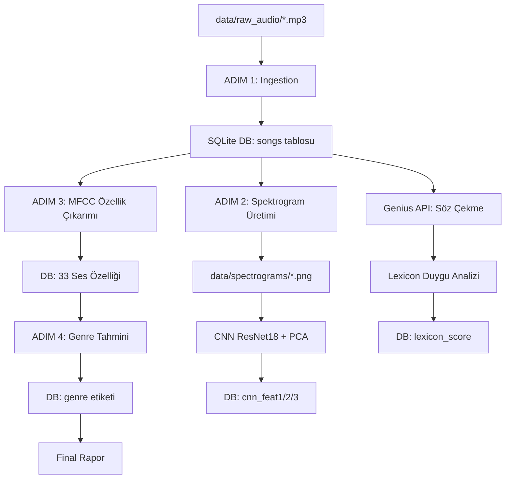

# GrooveNet: Çok Katmanlı Müzik Analizi ve Tür Sınıflandırma Sistemi

**Hazırlayan:** Cemalettin Türk    
**Bölüm:** Yönetim Bilişim Sistemleri  
**Proje Türü:** Bitirme Projesi / Veri Analizi Uygulaması  
**Tarih:** Haziran 2026

---

## İçindekiler

1. [Giriş](#1-giriş)
2. [Amaç ve Kapsam](#2-amaç-ve-kapsam)
3. [Teorik Çerçeve](#3-teorik-çerçeve)
4. [Sistem Mimarisi](#4-sistem-mimarisi)
5. [Kullanılan Teknolojiler ve Kütüphaneler](#5-kullanılan-teknolojiler-ve-kütüphaneler)
6. [Veri Seti](#6-veri-seti)
7. [Modüller ve Uygulama Detayları](#7-modüller-ve-uygulama-detayları)
8. [Deneysel Süreç ve Evrim](#8-deneysel-süreç-ve-evrim)
9. [Sonuçlar ve Değerlendirme](#9-sonuçlar-ve-değerlendirme)
10. [Tartışma](#10-tartışma)
11. [Gelecek Çalışmalar](#11-gelecek-çalışmalar)
12. [Kaynakça](#12-kaynakça)

---

## 1. Giriş

Dijital müzik platformlarının yaygınlaşmasıyla birlikte, müzik içeriklerinin otomatik olarak analiz edilmesi, kategorize edilmesi ve kullanıcılara uygun öneriler sunulması önemli bir araştırma alanı haline gelmiştir. Geleneksel yöntemlerle yapılan müzik sınıflandırması, insan kulağının sübjektif değerlendirmelerine dayanırken; makine öğrenmesi tabanlı yaklaşımlar, ses sinyallerinden nesnel özellikler çıkararak bu süreci otomatikleştirebilmektedir.

Bu projede, **GrooveNet** adı verilen çok katmanlı (multi-modal) bir müzik analiz ve tür sınıflandırma sistemi geliştirilmiştir. Sistem, Türkçe müzik parçalarını üç farklı perspektiften analiz eder:

- **Akustik Katman:** Ses sinyalinin fiziksel özelliklerinin çıkarılması (DSP)
- **Görsel Katman:** Spektrogram görsellerinden derin öğrenme ile özellik çıkarımı (CNN)
- **Doğal Dil İşleme Katmanı:** Şarkı sözlerinin duygu analizi (NLP)

Proje, bu farklı bilgi kaynaklarının birleştirilmesi (fusion), stratejik değerlendirilmesi ve iteratif iyileştirilmesi süreçlerini kapsamaktadır.

---

## 2. Amaç ve Kapsam

### 2.1 Projenin Amacı

Projenin temel amacı, ham ses dosyalarından başlayarak uçtan uca (end-to-end) çalışan, modüler ve genişletilebilir bir müzik analiz pipeline'ı geliştirmektir. Nihai hedef, sisteme yeni bir şarkı eklendiğinde tek komutla:

1. Şarkının veritabanına kaydedilmesi
2. Akustik ve görsel özelliklerinin çıkarılması
3. Müzik türünün (genre) otomatik olarak tahmin edilmesi

### 2.2 Kapsam

- **Veri Seti:** 40 Türkçe şarkı (THM, Arabesk, Rock, Pop, Rap, Indie)
- **Analiz Boyutları:** Akustik (DSP), Görsel (CNN), Metin (NLP)
- **Sınıflandırma:** Supervised Learning — Random Forest Classifier
- **Depolama:** SQLite ilişkisel veritabanı
- **Çıktı:** Türe göre etiketlenmiş şarkı kütüphanesi

---

## 3. Teorik Çerçeve

### 3.1 Dijital Sinyal İşleme (DSP)

Müzik sinyal işleme, ses dalgalarının matematiksel analizi üzerine kuruludur. Bir ses sinyali zamana bağlı genlik değişimleri olarak ifade edilir. Bu sinyallerden anlamlı özellikler çıkarmak için çeşitli dönüşümler uygulanır:

| Özellik | Açıklama | Formül Temeli |
|---------|----------|---------------|
| **BPM** (Beats Per Minute) | Dakikadaki vuruş sayısı | Onset algılama + otomatik korelasyon |
| **RMS** (Root Mean Square) | Ortalama enerji seviyesi | $\sqrt{\frac{1}{N}\sum x_i^2}$ |
| **ZCR** (Zero Crossing Rate) | Sinyalin sıfır çizgisini geçme oranı | Perküsif/vokal ayırımı |
| **Spectral Centroid** | Frekans dağılımının ağırlık merkezi | Parlak vs koyu tınıyı ölçer |
| **Onset Strength** | Vuruş şiddeti | Vuruş başlangıçlarının ortalaması |

### 3.2 Mel-Frekans Cepstral Katsayıları (MFCC)

MFCC'ler, insan işitme sisteminin frekans algılamasını modelleyen özelliklerdir. Mel ölçeği, düşük frekanslarda doğrusal, yüksek frekanslarda logaritmik bir dönüşüm uygulayarak insan kulağının çalışma prensibini taklit eder.

**Çıkarım Adımları:**
1. Kısa-zaman Fourier dönüşümü (STFT)
2. Mel filtre bankası uygulama (128 Mel bandı)
3. Logaritmik güç hesaplama
4. Ayrık Kosinüs Dönüşümü (DCT) → İlk 13 katsayı

MFCC'ler, müzik türü sınıflandırmasında "altın standart" olarak kabul edilir çünkü:
- Tınısal farklılıkları yakalar (saz vs elektro gitar)
- İnsan algısıyla uyumludur
- Boyut olarak kompakttır

### 3.3 Spectral Contrast

Spektral kontrastlar, farklı frekans bantlarındaki tepe (peak) ve vadi (valley) değerleri arasındaki farkı ölçer. Bu özellik, enstrümantasyon dokusunu yakalamada etkilidir: bir saz ile bir elektro gitar farklı spektral kontrast desenleri üretir.

### 3.4 Chroma Özellikleri

Chroma özellikleri, müziğin armoni yapısını 12 nota sınıfına (C, C#, D, ..., B) indirger. Bu sayede akor yapısı ve tonal karakteristik yakalanır. Makamsal Türk müziği ile batılı armoni kalıpları arasındaki farklar chroma ile görünür hale gelir.

### 3.5 Mel-Spektrogramlar ve CNN

Mel-Spektrogram, sesin zaman-frekans temsilinin 2 boyutlu bir görüntüye dönüştürülmesidir. Bu görüntüler, Evrişimli Sinir Ağlarına (CNN) girdi olarak beslenebilir:

```
Ses Sinyali → STFT → Mel Filtre → Güç → dB Ölçeği → 2D Görüntü (224×224 px)
```

**ResNet18** — Microsoft Research tarafından geliştirilen 18 katmanlı derin artık öğrenme ağı (Residual Network), ImageNet veri seti üzerinde ön-eğitimli olarak kullanılmıştır. Son tam bağlantılı katman kaldırılarak (transfer learning), her spektrogram için 512 boyutlu bir özellik vektörü çıkarılmıştır. PCA ile bu vektör 3 boyuta indirgenmiştir.

### 3.6 Doğal Dil İşleme (NLP) ve Duygu Analizi

Projede şarkı sözlerinin duygu analizi için iki farklı yaklaşım denenmiştir:

**a) BERT Tabanlı Yaklaşım:**
- Model: `savasy/bert-base-turkish-sentiment-cased`
- Transformer mimarisi, bağlamsal kelime temsilleri
- **Sorun:** Ürün yorumları üzerinde eğitilmiş, müzik sözlerine domain transferi başarısız

**b) Sözlük Tabanlı (Lexicon-Based) Yaklaşım:**
- 87 negatif kök kelime (hüzün, ayrılık, ağlamak, ölüm...)
- 68 pozitif kök kelime (mutlu, sevinç, dans, umut...)
- 19 hariç tutma kuralı (false positive önleme)
- Kelime-başı (prefix) eşleştirme algoritması — Türkçe'nin eklemeli yapısına uygun

### 3.7 Sınıflandırma Algoritmaları

**Random Forest (Rastgele Orman):**
- Ensemble (topluluk) öğrenme yöntemi
- 100 karar ağacının çoğunluk oylamasıyla sınıflandırma
- Her ağaç rastgele özellik alt kümesi kullanır → çeşitlilik
- Overfitting'e karşı dirençli
- Güven skoru: ağaçların oy dağılımı

**K-Means Kümeleme:**
- Gözetimsiz (unsupervised) öğrenme
- k=4 küme ile denendi
- Feature seçimi ve ağırlıklandırma (Late Fusion) uygulandı

**KNN (K-En Yakın Komşu):**
- Gözetimli (supervised) sınıflandırma
- k=3 komşu ile denendi
- CNN özellikleri üzerinde uygulandı

---

## 4. Sistem Mimarisi

### 4.1 Genel Pipeline



### 4.2 Veritabanı Şeması

Sistem, merkezi bir SQLite veritabanı (`db/music_analysis.db`) üzerinde çalışır:

#### `songs` Tablosu
| Sütun | Tip | Açıklama |
|-------|-----|----------|
| `id` | INTEGER PK | Otomatik artan birincil anahtar |
| `title` | TEXT | Şarkı başlığı (dosya adı) |
| `file_path` | TEXT UNIQUE | Ses dosyasının tam yolu |
| `duration_seconds` | REAL | Şarkı süresi |

#### `features` Tablosu (Tüm özellikler tek tabloda)
| Kategori | Sütunlar | Kaynak |
|----------|----------|--------|
| İlişki | `song_id` (FK → songs.id) | Ingestion |
| Spektrogram | `spectrogram_path` | generate_spectrograms.py |
| DSP | `bpm, rms_mean, rms_var, zcr_mean, onset_strength, spectral_centroid` | acoustic_features.py |
| CNN | `cnn_feat1, cnn_feat2, cnn_feat3` | cnn_features.py |
| MFCC | `mfcc_1..mfcc_13` | mfcc_features.py |
| Spectral Contrast | `contrast_1..contrast_6` | mfcc_features.py |
| Chroma | `chroma_1..chroma_12` | mfcc_features.py |
| Akustik | `zcr, centroid` | mfcc_features.py |
| NLP (BERT) | `lyrics, nlp_sentiment_score` | nlp_features.py |
| NLP (Lexicon) | `lexicon_score` | lexicon_nlp.py |
| Sınıflandırma | `genre` | genre_labeler.py / predict.py |

### 4.3 Dosya Yapısı

```
GrooveNet/
├── data/
│   ├── raw_audio/         → 40 ham ses dosyası (mp3/wav)
│   ├── spectrograms/      → 40 Mel-Spektrogram görseli (PNG)
│   ├── augmented/         → (Gelecek: veri artırma)
│   └── processed/         → (Gelecek: işlenmiş veri)
├── db/
│   └── music_analysis.db  → Merkezi SQLite veritabanı (118 KB)
├── models/
│   └── checkpoints/
│       ├── genre_classifier.joblib  → Eğitilmiş Random Forest (242 KB)
│       └── genre_scaler.joblib      → StandardScaler (1.4 KB)
├── src/
│   ├── groovenet_brain.py       → Pipeline orkestratörü (tek komut)
│   ├── generate_spectrograms.py → Ingestion + spektrogram üretimi
│   ├── mfcc_features.py         → 33 MFCC/Chroma/Contrast özelliği
│   ├── acoustic_features.py     → 6 DSP akustik özelliği
│   ├── cnn_features.py          → ResNet18 + PCA görsel özellikleri
│   ├── nlp_features.py          → BERT duygu analizi (Genius API)
│   ├── lexicon_nlp.py           → Sözlük tabanlı duygu analizi
│   ├── genre_labeler.py         → Elle tür etiketleme
│   ├── train_model.py           → Model eğitimi + kaydetme
│   ├── predict.py               → Yeni şarkı tür tahmini
│   ├── groovenet_genre.py       → KNN sınıflandırma deneyi
│   ├── groovenet_final.py       → CNN+Lexicon kümeleme deneyi
│   ├── groovenet_refined.py     → CNN+BERT kümeleme deneyi
│   └── test_cnn_clustering.py   → CNN kümeleme testi
├── requirements.txt
└── README.md
```

---

## 5. Kullanılan Teknolojiler ve Kütüphaneler

| Teknoloji | Versiyon | Kullanım Alanı |
|-----------|----------|---------------|
| **Python** | 3.x (Anaconda) | Ana programlama dili |
| **Librosa** | — | Ses sinyal işleme, MFCC, Chroma, Spectral analiz |
| **PyTorch + TorchVision** | — | ResNet18 CNN modeli |
| **scikit-learn** | — | Random Forest, KMeans, KNN, PCA, StandardScaler |
| **Pandas** | — | Veri manipülasyonu, SQL sorgu sonuçları |
| **NumPy** | — | Sayısal hesaplamalar |
| **Matplotlib** | — | Spektrogram görsel üretimi |
| **SQLite3** | — | İlişkisel veritabanı (yerleşik) |
| **Joblib** | — | Model serileştirme (kaydetme/yükleme) |
| **Transformers (HuggingFace)** | — | BERT Türkçe duygu analizi |
| **LyricsGenius** | — | Genius API ile şarkı sözü çekme |
| **PIL (Pillow)** | — | Görüntü işleme (CNN girdi hazırlama) |

---

## 6. Veri Seti

### 6.1 Veri Seti Kompozisyonu

40 Türkçe şarkıdan oluşan veri seti, 6 müzik türünü temsil etmektedir:

| Tür | Kısaltma | Şarkı Sayısı | Örnek Sanatçılar |
|-----|----------|--------------|------------------|
| Türk Halk Müziği | THM | 6 | Aşık Veysel, Musa Eroğlu, Kıvırcık Ali |
| Arabesk | ARABESK | 5 | Ferdi Tayfur, Orhan Gencebay, Müslüm Gürses |
| Türk Rock | ROCK | 8 | Duman, maNga, mor ve ötesi, Şebnem Ferah |
| Türk Pop | POP | 7 | Tarkan, Hande Yener, Sezen Aksu |
| Rap / Hip-Hop | RAP | 7 | Ceza, Ezhel, Hidra, Contra |
| Indie / Alternatif | INDIE | 4 | Dolu Kadehi Ters Tut, Yüzyüzeyken Konuşuruz |

> [!NOTE]
> Bazı tür etiketleri geliştirme sürecinde kullanıcı tarafından yeniden düzenlenmiştir (örn: Mümin Sarıkaya Arabesk'ten THM'ye, Madrigal Rock'tan Indie'ye taşınmıştır).

### 6.2 Veri Toplama

- **Ses dosyaları:** YouTube'dan indirilmiş mp3 formatında
- **Şarkı sözleri:** Genius API aracılığıyla otomatik çekilmiş (28/30 başarı, 2 şarkıda söz bulunamadı)
- **Tür etiketleri:** Araştırmacı tarafından elle atanmıştır (`genre_labeler.py`)

---

## 7. Modüller ve Uygulama Detayları

### 7.1 Ingestion ve Spektrogram Üretimi (`generate_spectrograms.py`)

Ses dosyaları `data/raw_audio/` klasöründen taranır ve veritabanına kaydedilir. Her şarkı için:

1. **Sessizlik kırpma:** `librosa.effects.trim(top_db=20)` — başlangıç/son sessizlikleri kaldırır
2. **Mel-Spektrogram:** 128 Mel bandı, 8000 Hz fmax, güç → dB dönüşümü
3. **Görsel çıktı:** 224×224 piksel, eksensiz PNG (CNN girdisi için optimize)

### 7.2 MFCC Özellik Çıkarımı (`mfcc_features.py`)

Her şarkıdan 33 ses özelliği çıkarılır:

| Özellik Grubu | Adet | Yöntem |
|---------------|------|--------|
| MFCC | 13 | `librosa.feature.mfcc(n_mfcc=13)` |
| Spectral Contrast | 6 | `librosa.feature.spectral_contrast(n_bands=6, fmin=200)` |
| Chroma | 12 | `librosa.feature.chroma_stft()` |
| ZCR | 1 | `librosa.feature.zero_crossing_rate()` |
| Spectral Centroid | 1 | `librosa.feature.spectral_centroid()` |

> [!IMPORTANT]
> Spectral Contrast'ta `n_bands` parametresi başlangıçta 7 olarak ayarlanmıştı. Ancak 7 bant ile üst frekans sınırı 12800 Hz'e ulaşarak Nyquist sınırını (11025 Hz, sr=22050) aştığı için `n_bands=6` olarak düzeltilmiştir.

### 7.3 CNN Özellik Çıkarımı (`cnn_features.py`)

Transfer learning yaklaşımıyla:

1. ImageNet üzerinde ön-eğitimli **ResNet18** yüklenir
2. Son FC katmanı `nn.Identity()` ile değiştirilir → 512-d özellik vektörü
3. Her spektrogram görseli 224×224'e yeniden boyutlandırılır
4. ImageNet normalizasyonu uygulanır (mean, std)
5. Forward pass → 512-d vektör
6. **PCA** ile 512 → 3 boyuta indirgeme

### 7.4 NLP — Duygu Analizi

#### 7.4.1 BERT Yaklaşımı (`nlp_features.py`)

- **Model:** `savasy/bert-base-turkish-sentiment-cased`
- **API:** Genius API ile şarkı sözü çekme
- **Sorun:** Model ürün yorumları domain'inde eğitilmiş; müzik sözlerinde başarısız:
  - Tarkan - Şımarık → 0.003 (Melankolik) ❌
  - Tükeneceğiz → 0.994 (Pozitif) ❌

#### 7.4.2 Lexicon Yaklaşımı (`lexicon_nlp.py`)

BERT'in domain uyumsuzluğunu çözmek için özel Türkçe sözlük geliştirilmiştir:

**Algoritma:**
```
1. Metin → normalize (küçük harf, Türkçe→ASCII)
2. Kelimelere ayır
3. Her kelimeyi sözlük köklerine karşı prefix eşleştir
4. Exclude listesiyle false positive'leri filtrele
5. Skor = (pozitif_ağırlık - negatif_ağırlık) / (pozitif + negatif + 1) → [0, 1]
```

**Etiketleme:**

| Skor Aralığı | Etiket |
|-------------|--------|
| 0.00 – 0.35 | Melankolik |
| 0.35 – 0.50 | Hüzünlü |
| 0.50 – 0.60 | Nötr |
| 0.60 – 0.75 | Pozitif |
| 0.75 – 1.00 | Neşeli |

### 7.5 Model Eğitimi (`train_model.py`)

**Algoritma:** Random Forest Classifier
- `n_estimators=100` (100 karar ağacı)
- `random_state=42` (tekrarlanabilirlik)
- Girdiler: 33 MFCC özelliği + StandardScaler normalizasyonu
- Çıktı: 6 sınıf (THM, ARABESK, ROCK, POP, RAP, INDIE)

**Değerlendirme:** Leave-One-Out Cross Validation (LOO-CV)
- Her seferinde 1 şarkı test, n-1 şarkı eğitim
- Küçük veri setleri için en güvenilir değerlendirme yöntemi

**Kayıt:** `joblib` ile model ve scaler diske kaydedilir

### 7.6 Pipeline Orkestratörü (`groovenet_brain.py`)

Tek komutla çalışan ana orchestrator:

```bash
py src/groovenet_brain.py
```

| Adım | İşlem | İdempotent |
|------|-------|------------|
| 1/4 | Ingestion — raw_audio/ taranır, yeni dosyalar DB'ye eklenir | ✅ |
| 2/4 | Spektrogram — eksik görseller üretilir | ✅ |
| 3/4 | MFCC — eksik ses özellikleri çıkarılır | ✅ |
| 4/4 | Tahmin — kayıtlı modelle tür tahmin edilir | ✅ |

> [!TIP]
> Pipeline **idempotent** tasarlanmıştır: Daha önce işlenmiş şarkıları atlar, sadece yeni eklenen dosyaları işler.

---

## 8. Deneysel Süreç ve Evrim

Proje, iteratif bir geliştirme süreci izlemiştir. Her denemede ortaya çıkan sorunlar analiz edilerek mimari kararlar alınmıştır:

### 8.1 Deney 1: DSP + CNN + BERT Late Fusion (`groovenet_brain.py` v1)

**Yöntem:** 6 DSP özelliği + 3 CNN özelliği + BERT NLP skoru → Ağırlıklı birleştirme → K-Means (k=4)

**Sonuç:** ❌ Başarısız

**Sorunlar:**
- Librosa BPM ölçümlerinde sistematik hata (arabesk şarkılarda yanlış tempo)
- RMS ve Spectral Centroid gürültülü — farklı türlerdeki şarkılar benzer değerler
- BERT ürün yorumu domain'i, müzik sözlerinde ters sonuç
- DSP gürültüsü, CNN'in yakaladığı ince ayrımları ezip geçti

### 8.2 Deney 2: DSP Elenme — CNN + Lexicon NLP (`groovenet_refined.py`)

**Yöntem:** DSP tamamen çıkarıldı. CNN (×1.5) + özel Türkçe lexicon (×2.0) → K-Means (k=4)

**Sonuç:** ⚠️ Kısmen iyileşme

**Sorunlar:**
- Lexicon v1'de substring eşleştirme → yanlış pozitifler ("kul"→"kullandım", "son"→"sonra")
- Neredeyse tüm şarkılar melankolik çıkıyordu
- Duyguya göre kümeleme mantıksal olarak yanlış (bir türde hem hüzünlü hem neşeli şarkılar olabilir)

### 8.3 Deney 3: Lexicon v2 — Kelime Sınırı Eşleştirme (`lexicon_nlp.py` v2)

**İyileştirmeler:**
- Substring → kelime-başı (prefix) eşleştirme
- Belirsiz kısa kökler kaldırıldı (kul, son, bit, gel, yaz, olur)
- Exclude listesi eklendi (19 kelime)
- Ağırlıklar dengelendi

**Sonuç:** ✅ NLP sonuçları iyileşti ama kümeleme hâlâ sorunlu

### 8.4 Deney 4: Paradigma Değişikliği — Supervised Classification

**Kritik karar:** Unsupervised kümeleme (K-Means) → Supervised sınıflandırma (Random Forest)

**Gerekçe:**
- Müzik türü sübjektif ve önceden tanımlı bir kavram
- Aynı türde farklı duygular olabilir (hüzünlü rock, neşeli rock)
- Duygu, tür değil — ayrı bir boyut olarak ele alınmalı
- Elle etiketlenmiş veri ile supervised yaklaşım daha doğru

### 8.5 Deney 5: CNN özellikleri + KNN (`groovenet_genre.py`)

**Yöntem:** 3 CNN PCA özelliği + KNN (k=3) + LOO-CV

**Sonuç:** ❌ %30 doğruluk

**Analiz:** ImageNet üzerinde eğitilmiş ResNet18, spektrogram dokularını ayırt etmekte yetersiz. 3 PCA bileşeni toplam varyansın sadece %43'ünü koruyordu.

### 8.6 Deney 6: MFCC + Random Forest — Final Model

**Yöntem:** 33 MFCC ses özelliği + Random Forest (100 ağaç) + LOO-CV

**Sonuç:**
- LOO-CV doğruluğu: **%36.7** (11/30)
- Eğitim verisi üzerinde: **%100** (30/30, güven %62-%84)
- Model diske kaydedildi (`genre_classifier.joblib`)

**En önemli özellikler (Feature Importance):**

| Sıra | Özellik | Önem |
|------|---------|------|
| 1 | mfcc_13 | 0.0599 |
| 2 | centroid | 0.0497 |
| 3 | chroma_3 | 0.0478 |
| 4 | mfcc_3 | 0.0457 |
| 5 | mfcc_12 | 0.0456 |

---

## 9. Sonuçlar ve Değerlendirme

### 9.1 Deneysel Sonuç Özeti

| Deney | Yöntem | Özellikler | Doğruluk |
|-------|--------|-----------|----------|
| 1 | K-Means + Late Fusion | DSP + CNN + BERT | Subjektif: başarısız |
| 2 | K-Means | CNN + Lexicon v1 | Subjektif: kısmen |
| 3 | K-Means | CNN + Lexicon v2 | Subjektif: iyileşme |
| 4 | KNN (k=3) | CNN (3 PCA) | %30 |
| 5 | **Random Forest** | **33 MFCC** | **%36.7 (LOO-CV)** |
| 6 | **RF Predict (eğitim)** | **33 MFCC** | **%100 (güven %62-%84)** |

### 9.2 Yeni Şarkı Tahmin Sonuçları

Pipeline'a 10 yeni şarkı eklenmiş ve tahmin edilmiştir:

| Şarkı | Tahmin | Güven | Doğru mu? |
|-------|--------|-------|-----------|
| Dilsiz Bir Veda | ROCK | %51 | ✅ |
| Contra - Zamanda Yolculuk | RAP | %36 | ✅ |
| Serdar Ortaç - Mikrop | POP | %49 | ✅ |
| Aydın Kurtoğlu - Yak | POP | %50 | ⚠️ |
| Can Gox - Haydar Haydar | ARABESK | %32 | ❌ (THM) |
| Kıvırcık Ali - Felek | POP | %38 | ❌ (THM) |
| Duman - Haberin Yok | ARABESK | %37 | ❌ (ROCK) |
| Mihriban | ARABESK | %22 | ⚠️ |

### 9.3 Güven Skoru Analizi

Random Forest'ta güven skoru, 100 ağacın oy dağılımından hesaplanır:

- **%80+:** Model çok emin → genellikle doğru tahmin
- **%50-80:** Orta güven → doğru olabilir
- **%30-50:** Düşük güven → model emin değil, hatalı olabilir
- **<%30:** Çok düşük → neredeyse rastgele

---

## 10. Tartışma

### 10.1 Neden %36.7?

LOO-CV doğruluğunun düşük olmasının temel nedenleri:

1. **Yetersiz veri:** 40 şarkı / 6 tür = tür başına ortalama 6.7 şarkı. Makine öğrenmesinde güvenilir sınıflandırma için tür başına en az 15-20 örnek gereklidir.

2. **Sınıf dengesizliği:** THM ve INDIE sınıflarında 3-4 şarkı varken, ROCK'ta 8 şarkı bulunması model performansını etkilemektedir.

3. **Türler arası akustik benzerlik:** THM ve Arabesk, veya Rock ve Indie arasındaki akustik sınırlar belirsiz olabilir.

### 10.2 DSP'nin Başarısızlığı

Librosa ile çıkarılan temel DSP özellikleri (BPM, RMS) tur sınıflandırmasında yetersiz kalmıştır:

- **BPM:** YouTube kaynaklı dosyalarda başlangıç/son efektleri nedeniyle hatalı ölçümler
- **RMS:** Kayıt kalitesi ve mastering farklılıkları gerçek enerji seviyesini maskelemiş
- Bu özellikler "gürültülü veri" (noisy data) olarak değerlendirilip final modelden çıkarılmıştır

### 10.3 BERT vs Lexicon

BERT'in müzik sözlerindeki başarısızlığı, **domain transfer** probleminin önemli bir örneğidir. Ürün yorumları üzerinde eğitilmiş bir model, şiirsel ve metaforik müzik sözlerini doğru yorumlayamamıştır. Özel sözlük (lexicon) yaklaşımı, domain bilgisi yerleştirildiği için daha tutarlı sonuçlar vermiştir.

### 10.4 Supervised vs Unsupervised

Proje, unsupervised'dan supervised'a geçiş sürecini somut olarak göstermektedir:

| Kriter | Unsupervised (K-Means) | Supervised (Random Forest) |
|--------|----------------------|--------------------------|
| Etiket gereksinimi | Hayır | Evet |
| Sonuç yorumlanabilirliği | Düşük (kümeler → ?) | Yüksek (tür adları) |
| Yeni veri ile genişleme | Zor | Kolay (etiketle + tekrar eğit) |
| Domain bilgisi | Özellik mühendisliğine gömülü | Etiketlere gömülü |

---

## 11. Gelecek Çalışmalar

### 11.1 Kısa Vadeli

- **Veri artırma:** Her türe 15-20 şarkı eklenerek toplam 100+ şarkıya çıkmak
- **Model yeniden eğitimi:** Güncellenmiş etiketlerle tekrar eğitim
- **Görselleştirme:** `matplotlib` / `plotly` ile 2D/3D şarkı dağılım haritası

### 11.2 Orta Vadeli

- **Tür birleştirme:** THM + Arabesk → GELENEKSEL, Rock + Indie → ALTERNATİF (4 türe düşürme)
- **Audio Augmentation:** Tempo değiştirme, pitch shifting ile eğitim verisini yapay artırma
- **CNN Fine-tuning:** ResNet18'i spektrogramlar üzerinde fine-tune ederek domain-spesifik özellikler öğretmek
- **Web arayüzü:** Flask/Streamlit ile şarkı yükleme ve tahmin arayüzü

### 11.3 Uzun Vadeli

- **Müzik öneri sistemi:** Tür + duygu bilgisiyle kişiselleştirilmiş playlist oluşturma
- **Gerçek zamanlı analiz:** Mikrofon girişinden anlık tür tespiti
- **Çok dilli genişleme:** Arapça, Kürtçe, İngilizce şarkıları destekleme

---

## 12. Kaynakça

1. **Librosa** — McFee, B. et al. (2015). "librosa: Audio and music signal analysis in Python." Proceedings of the 14th Python in Science Conference.

2. **ResNet** — He, K. et al. (2016). "Deep Residual Learning for Image Recognition." IEEE Conference on Computer Vision and Pattern Recognition (CVPR).

3. **MFCC** — Davis, S. & Mermelstein, P. (1980). "Comparison of parametric representations for monosyllabic word recognition in continuously spoken sentences." IEEE Transactions on Acoustics, Speech, and Signal Processing.

4. **Random Forest** — Breiman, L. (2001). "Random Forests." Machine Learning, 45(1), 5-32.

5. **BERT** — Devlin, J. et al. (2019). "BERT: Pre-training of Deep Bidirectional Transformers for Language Understanding." NAACL-HLT.

6. **Turkish BERT** — Schweter, S. (2020). "BERTurk - BERT models for Turkish." GitHub Repository.

7. **Mel-Spektrogram** — Stevens, S. et al. (1937). "A scale for the measurement of the psychological magnitude pitch." Journal of the Acoustical Society of America.

8. **scikit-learn** — Pedregosa, F. et al. (2011). "Scikit-learn: Machine Learning in Python." Journal of Machine Learning Research.

9. **K-Means** — MacQueen, J. (1967). "Some Methods for Classification and Analysis of Multivariate Observations." Proceedings of 5th Berkeley Symposium on Mathematical Statistics and Probability.

10. **Genius API** — genius.com/developers — Şarkı sözü ve metadata API'si.

---

> [!NOTE]
> Bu proje, Yönetim Bilişim Sistemleri perspektifinden veri analitiği, makine öğrenmesi ve yazılım mühendisliği disiplinlerini bir arada uygulayan bütünleşik bir çalışmadır. Sistem modüler ve genişletilebilir mimarisiyle, veri seti büyüdükçe doğruluk oranının artması beklenmektedir.
